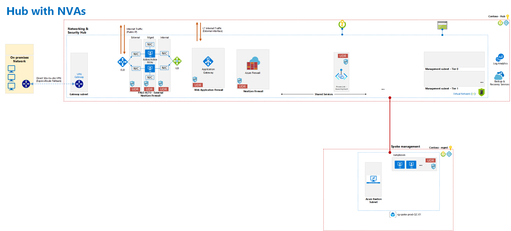

# Diagram landing zone deployment  

# Prerequisites for landing zone deployment  

1 - create a SPN for each subscription scope
    
    az ad sp create-for-rbac --name SP_iac_1  --role contributor  --scopes /subscriptions/subscription_id_1
    az ad sp create-for-rbac --name SP_iac_2  --role contributor  --scopes /subscriptions/subscription_id_2
    az ad sp create-for-rbac --name SP_iac_3  --role contributor  --scopes /subscriptions/subscription_id_3

2 - Copy the SPN's details in the variable.tfvars file. Note that the default provider will also have the SP_iac_1 details as this is fo rthe HUB

3 - Run this command for the Subscription that will hold the PA cluster : 
    
    for urn in $(az vm image list --all --publisher paloaltonetworks --offer vmseries-flex --sku byol --query '[].urn' --output tsv) \ 
    do az vm image accept-terms --urn $urn \
    done

4 - Create a storage account for the TF state file
    
    Please add the details in the “version.tf” file in the mail root folder ( Account name, create a container and take the key) , the file tfstate will be created automatically. 

5 - Change the tfvars variable files with the right input if required 

    As per our knowledge , only Pre-Shared Key and 

6 - Then run the scripts : 

    terraform.exe init -upgrade 
    terraform.exe plan -var-file variables.tfvars
    terraform.exe apply -var-file variables.tfvars -lock=false -auto-approve

7 Create separate environment  : 
    
    By changing variables, you can create a brand-new environment. 
    Note : all paid services are there. Total : 6500$/month of sizing / Azure counts 730 hours per month or 8.9$/hours

